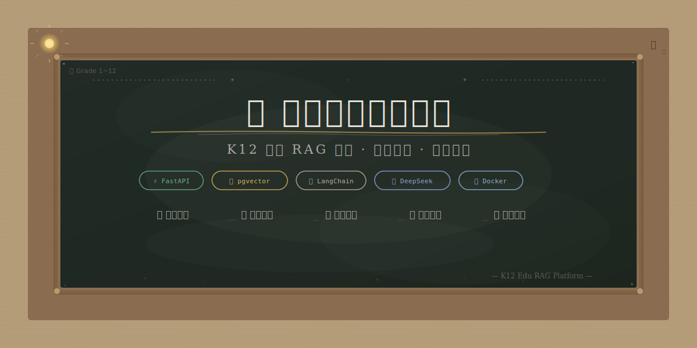

<p align="center">
  
</p>

<p align="center">
  <b>If you can ask, it can teach.</b><br>
  <i>面向 K12 教育的 RAG 智能问答系统 — 从教材到答案，一步到位</i>
</p>

---

<p align="center">
  <table align="center">
    <tr>
      <td align="center" width="200">
        <br>
        <b>智能问答</b><br>
        <sub>四维过滤检索</sub>
      </td>
      <td align="center" width="200">
        <br>
        <b>试题生成</b><br>
        <sub>5种题型 × 3级难度</sub>
      </td>
      <td align="center" width="200">
        <br>
        <b>错题分析</b><br>
        <sub>LLM 知识点推理</sub>
      </td>
      <td align="center" width="200">
        <br>
        <b>文档管理</b><br>
        <sub>12 年级全册覆盖</sub>
      </td>
    </tr>
  </table>
</p>

---

## 🏗️ Architecture

```
┌─────────────────────────────────────────────────────────┐
│                    🌐 用户浏览器                           │
│              http://localhost:3000                       │
│         HTML5 + CSS3 + KaTeX 公式渲染                     │
└──────────────────────┬──────────────────────────────────┘
                       │  REST API
                       ▼
┌─────────────────────────────────────────────────────────┐
│              ⚡ FastAPI 后端 (:8000)                      │
│                                                        │
│   ┌──────────┐  ┌──────────┐  ┌──────────────────┐    │
│   │ 文档加载  │  │ RAG 检索  │  │  LLM 智能推理     │    │
│   │ 自动检测  │  │ 四维过滤  │  │  DeepSeek V4     │    │
│   │ 年级/学科 │  │ 阈值 0.5 │  │  问答+出题+分析   │    │
│   └──────────┘  └──────────┘  └──────────────────┘    │
│                                                        │
│   ┌──────────┐  ┌──────────┐  ┌──────────────────┐    │
│   │ pgvector │  │  Redis   │  │  百炼 Embedding    │    │
│   │ 向量存储  │  │ 查询缓存  │  │  text-embed-v3   │    │
│   └──────────┘  └──────────┘  └──────────────────┘    │
└─────────────────────────────────────────────────────────┘
```

---

## ✨ Why SmartTextbook AI?

| 🎯 精准检索 | 🧒 难度自适应 | 🧠 智能分析 | 🎨 黑板风 UI |
|:---:|:---:|:---:|:---:|
| 年级 + 学科 + 章节 + 知识点<br>四维过滤，只找对的内容 | 根据学生年级自动调整<br>用语难度和解释深度 | 错题→LLM 推理→教材知识点<br>自动匹配所属章节 | 原生 HTML/CSS<br>KaTeX 数学公式完美渲染 |

---

## 🚀 Quick Start

```bash
# 1️⃣ 启动数据库
docker start edu-postgres edu-redis

# 2️⃣ 启动后端 API
cd rag_test
python3.11 -c "from app.edu_api import app; import uvicorn; uvicorn.run(app, host='0.0.0.0', port=8000, reload=False)"

# 3️⃣ 启动前端
cd ui && python3.11 -m http.server 3000
```

然后打开 **http://localhost:3000** 🎉

<details>
<summary>📦 首次使用？导入教材文档</summary>

```bash
cd rag_test
python3.11 -c "
from app.edu_document_loader import load_from_directory
from app.edu_splitter import split_documents
from app.config import settings
from langchain_openai import OpenAIEmbeddings
from langchain_postgres.vectorstores import PGVector

docs = load_from_directory('data/textbooks', doc_type='textbook', grade='初三', subject='数学')
chunks = split_documents(docs)
embeddings = OpenAIEmbeddings(model='text-embedding-v3', api_key=settings.DASHSCOPE_API_KEY,
    base_url='https://dashscope.aliyuncs.com/compatible-mode/v1',
    tiktoken_enabled=False, check_embedding_ctx_length=False)
for i in range(0, len(chunks), 10):
    PGVector.from_documents(documents=chunks[i:i+10], embedding=embeddings,
        connection=settings.database_url, collection_name='edu_初三_数学')
print('✅ 导入完成')
```
</details>

---

## 🛠️ Tech Stack

| Layer | Technology |
|:---|:---|
| 🎨 Frontend | HTML5 · CSS3 · JavaScript · KaTeX |
| ⚡ Backend | FastAPI · Uvicorn · LangChain |
| 🧠 LLM | DeepSeek V4 Flash |
| 🧬 Embedding | 百炼 text-embedding-v3（1024 dims） |
| 🗄️ Vector DB | PostgreSQL + pgvector |
| 🔴 Cache | Redis |
| 📄 Parsing | PyPDF · python-docx · Unstructured |
| 🐳 DevOps | Docker · Docker Compose |

---

## 📂 Project Structure

```
rag_test/
├── app/                          # 后端核心
│   ├── config.py                 # 配置管理 (.env)
│   ├── edu_document_loader.py    # 文档加载 & 自动检测
│   ├── edu_splitter.py           # 智能切分 & 章节识别
│   ├── edu_rag_engine.py         # RAG 引擎 (检索/重排/生成)
│   ├── edu_features.py           # 试题生成/图谱/错题分析
│   └── edu_api.py                # 6 个 RESTful 接口
├── ui/index.html                 # 黑板风格前端 (2647 行)
├── data/textbooks/               # 1~12 年级数学全册 📚
├── docker-compose.yml            # 容器编排
└── .env                          # 环境变量 (gitignore)
```

---

## 🎯 Learning Path

```
📖 上传教材 ──→ 🔬 向量化入库 ──→ 💬 智能问答
                    │
                    ├── 📝 试题生成 (5 种题型)
                    ├── 📊 错题分析 (LLM 知识点映射)
                    └── 📁 文档管理 (上传/删除)
```

---

## 🌍 你好 · Hello · こんにちは · Bonjour

本项目支持 1~12 年级数学全册教材，覆盖小学到高中全部知识点。

欢迎世界各地的教育者和开发者一起贡献！🌟

---

<p align="center">
  <sub>Built with ❤️ using FastAPI + LangChain + DeepSeek + pgvector</sub>
</p>
